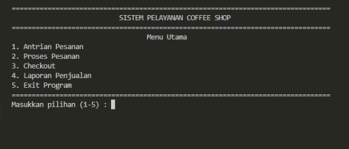
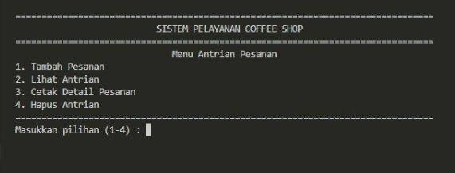
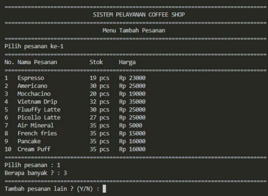
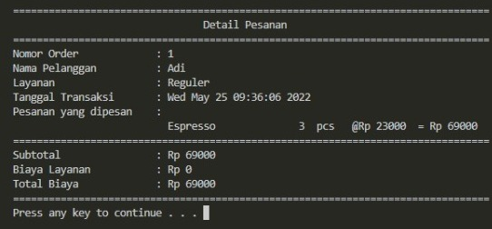
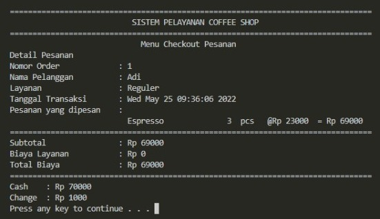
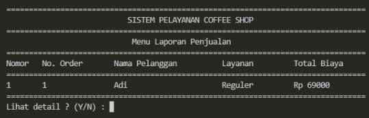

  <h2 align="center">
    SISTEM PELAYANAN COFFEE SHOP
  </h2>

<!-- Daftar Isi -->

  
<h2 style="display: inline-block">Daftar Isi</h2>

  <ol>
    <li><a href="#anggota-tim">Anggota Tim</a></li>
    <li><a href="#latar-belakang">Latar Belakang</a></li>
    <li><a href="#tujuan-dan-manfaat">Tujuan dan Manfaat</a></li>
    <li><a href="#penjelasan-aplikasi">Penjelasan Aplikasi</a></li>
    <li><a href="#gambar-rancangan-antarmuka">Gambar Rancangan Antarmuka</a></li>
    <li><a href="#rencana-pengerjaan-proyek">Rencana Pengerjaan Proyek</a></li>
    <li><a href="#lisensi">Lisensi</a></li>
  </ol>

<!-- Anggota Tim -->
## Anggota Tim
| NPM           | Name                      |
| ------------- |-------------------------  |
| 140810210003  | Muhammad Ikhsan Fadhilah    |
| 140810210013  | Muhammad Giat	        |
| 140810210029  | Rifqi Muhadzib Ahdan        |

<!-- Latar Belakang -->
## Latar Belakang
Dalam bidang kuliner, masih terdapat banyak pelaku usaha yang melakukan pencatatan transaksi secara manual yang dianggap kurang efisien.  Selain itu, beberapa permasalahan dalam sistem pelayanan coffe shop seperti kesalahan pencatatan menu yang dipilih pelanggan, kesalahan dalam perhitungan total biaya,  kesalahan nomor urut antrian, ataupun hilangnya catatan transaksi suatu coffe shop dapat meningkatkan risiko kerugian yang dialami oleh owner.
	
Oleh karena itu, kami memiliki ide untuk membuat suatu program pelayanan coffe shop yang memiliki fitur untuk memproses antrian berdasarkan skala prioritas, sistem pembayaran pesanan, menampilkan laporan penjualan, dan update persediaan suatu menu pada coffe shop berbasis bahasa C/C++ dengan antarmuka menggunakan Command Line Interface.

<!-- Tujuan dan Manfaat -->
## Tujuan dan Manfaat
* Tujuan
  <ol>
    <li>Mengatur antrian pesanan </li>
    <li>Memproses pesanan berdasarkan skala prioritas  </li>
    <li>Memproses pembayaran pesanan  </li>
    <li>Menampilkan laporan penjualan    </li>
  </ol>
   
* Manfaat
  <ol>
    Manfaat pembuatan program ini adalah untuk melatih pemahaman dan kreativitas praktikan dalam mengimplementasikan materi struktur data yang sudah disampaikan selama satu semester menjadi suatu program yang dapat berjalan sesuai fungsinya. Selain itu, kami berharap program yang telah dibuat dapat berguna dan menjadi inspirasi bagi pelaku usaha di bidang kuliner yang masih menggunakan metode tulis tangan dalam sistem pelayanannya. 
  

<!-- Penjelasan Aplikasi -->
## Penjelasan Aplikasi
Program sistem pelayanan restoran direncanakan memiliki Lima fungsi utama, antara lain :  
<ul>
    <li>Antrian Pesanan : Berfungsi untuk menambahkan pesanan, melihat antrian, dan mencetak detail dari pesanan tertentu berdasarkan nomor pesanan</li>
    <li>Proses Pesanan : Berfungsi memproses pesanan pelanggan dengan memperhatikan skala prioritas yang diinputkan pada fungsi tambah pesanan/li>
    <li>Checkout : Pembayaran pesanan oleh pelanggan</li>
    <li>Laporan Penjualan : Daftar transaksi yang telah dilakukan</li>
    <li>Menampilkan barang-barang yang telah terjual</li> 
    <li>Exit Program : Fungsi untuk keluar dari program</li> 

<!-- Gambar Rancangan Antarmuka -->
## Gambar Rancangan Antarmuka

* Gambaran Menu awal
  

* Gambaran Menu Antrian

* Gambaran Menu Tambahan Pesanan

* Gambaran Detail Pesanan

* Gambaran Check Out

* Gambaran Laporan Penjualan

<!-- Rencana Pengerjaan Proyek -->
## Rencana Pengerjaan Proyek

Kami menggunakan beberapa tools seperti google docs, github, replit, dan visual studio code untuk pengerjaan proyek. Selain itu, antar anggota kelompok berkoordinasi melalui google meet, dan whatsapp. Untuk pembagian tugas, kami saling membantu di setiap bagian program yang dikerjakan dan belum ada pembagian tugas yang spesifik.

<!-- Lisensi -->
## Lisensi

MIT License 2022
